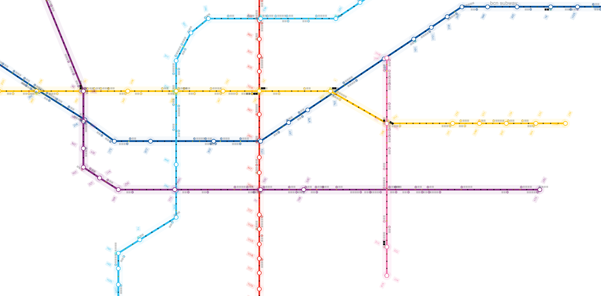

## Farzam

### Instalation Guide:
* Clone git repository  
* Install yarn or npm(node package manager)  
* Install parcell using `yarn add parcel`or `npm i parcel`  
* Build and start files using `build` and `start`  
* Output files are generated in dist folder  